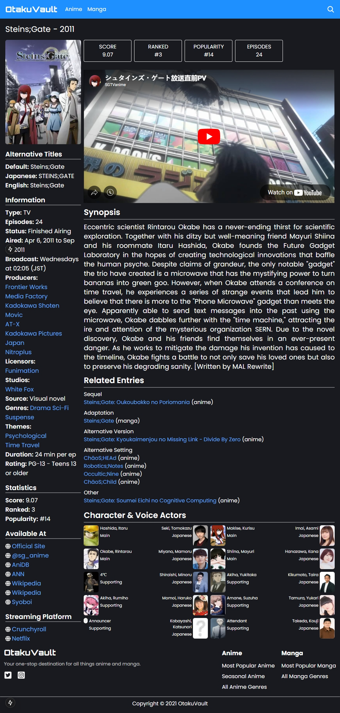

# OtakuVault

OtakuVault is a dynamic and responsive anime database web application built with **Next.js**, **TypeScript**, and **Tailwind CSS**. It utilizes the [Jikan API](https://jikan.moe) to deliver up-to-date anime information for fans and newcomers alike.

## 🔍 Features

- 🌟 **Main Page**

  - Displays current season anime
  - Lists most popular anime
  - Randomized recommended anime

- 🔎 **Search Functionality**

  - Search for anime by title
  - Results rendered in a responsive grid

- 📄 **Anime Details Page**
  - Alternative titles (English, Japanese, etc.)
  - Anime information (type, episodes, status, etc.)
  - Anime statistics (score, rank, popularity, etc.)
  - Embedded YouTube trailer
  - Synopsis of the anime
  - Related entries (prequels, sequels, adaptations, etc.)
  - Characters and their Japanese voice actors with images

## 🛠️ Tech Stack

- **Framework**: Next.js (App Router)
- **Language**: TypeScript
- **Styling**: Tailwind CSS
- **Data Source**: [Jikan API](https://jikan.moe)
- **Hosting**: Vercel

## 📦 Installation

```bash
git clone https://github.com/malvz22/otaku-vault.git
cd otaku-vault
npm install
npm run dev
```

## 🚀 Deployment

This app is deployed on Vercel.

## 📸 Screenshots

### 🔹 Home Page


### 🔹 Anime Info Page



### 🔹 Search Results


## 🏆 Credits

- Developed by: [malvz22](https://github.com/malvz22)
- API Used: [Jikan API](https://jikan.moe)
